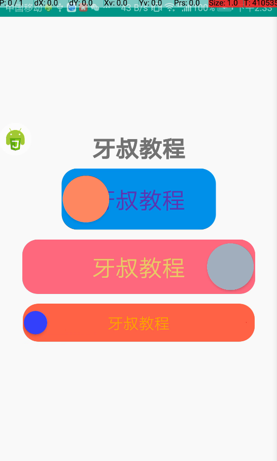

# autojs自定义Switch

牙叔教程 简单易懂

## 使用场景

自定义控件


## 效果展示




## autojs版本

8.8.20-0


## 为什么自定义控件

为了UI界面漂亮


## 怎样自定义控件

autojs软件自带的示例 / 界面控件 / 自定义控件 , 这是简单的例子, 可以看看

商店里面也有一些自定义控件例子,

比如

自定义控件Switch(这是大柒写的, 跟我写的自定义不一样), 

MagicIndicator(这是沐泠写的)

Shape3.0

ShimmerButton

自定义控件

等等


## 自定义控件思路

一般我们是为了修改控件的颜色, 形状, 布局, 以及运动效果, 

对应的修改思路如下:

**颜色**: 修改控件背景, 前景, 其中使用频率最高的是view.setBackgroundDrawable

**形状**: 使用canvas画形状

**布局**: CustomView.prototype.render

**运动效果**: animation


## 自定义控件难点

主要是距离的计算

必须搞清楚 margin, padding, view.getMeasuredHeight();

getLeft(), getWidth(), getX(), getPaddingLeft(), rect, drawRoundRect

他们之间的关系;

尤其是涉及到了文字, 文字居中更难,必须了解 getFontMetricsInt()


## 本教程的自定义Switch可以定义的属性

文字颜色

文字大小

轨道宽高

轨道颜色

轨道圆角

进度条颜色

小球圆角

小球颜色

小球点击事件


## 代码讲解

##### 1. 停止其他脚本, 主要方便测, 不然脚本运行的多了, 容易报错

```js
engines.all().map((ScriptEngine) => {
  if (engines.myEngine().toString() !== ScriptEngine.toString()) {
    ScriptEngine.forceStop();
  }
});
```


##### 2. 导入用到的类

```js
importClass(android.graphics.PaintFlagsDrawFilter);
importClass(android.graphics.Color);
importClass(android.animation.ObjectAnimator);
importClass(android.animation.AnimatorListenerAdapter);
importClass(android.util.TypedValue);
```


##### 3. UI界面

```js
ui.layout(
  <vertical gravity="center">
    <text textSize="30sp" text="牙叔教程" textStyle="bold" w="*" gravity="center"></text>
    <custom-view
      id="customView"
      textColor="#5e35b1"
      trackColor="#0091ea"
      progressBarColor="#ffeb3b"
      ballColor="#ff8a65"
      w="200dp"
      h="80dp"
      textSize="30sp"
      trackRadius="60"
      ballRadius="60"
    ></custom-view>
    <custom-view
		...
    ></custom-view>
    <custom-view
		...
    ></custom-view>
  </vertical>
);
```


## 自定义控件主要代码

##### 1. 所有单位统一转换为px

```js
const displayMetrics = context.getResources().getDisplayMetrics();
const all_2Px = (value) => {
  if (value.indexOf("px") >= 0) {
    let result = value.replace("px", "");
    return parseInt(result);
  } else if (value.indexOf("dp") >= 0) {
    let result = parseFloat(value.replace("dp", ""));
    result = TypedValue.applyDimension(TypedValue.COMPLEX_UNIT_DIP, result, displayMetrics);
    return parseInt(result);
  } else if (value.indexOf("in") >= 0) {
    let result = parseFloat(value.replace("in", ""));
    result = TypedValue.applyDimension(TypedValue.COMPLEX_UNIT_IN, result, displayMetrics);
    return parseInt(result);
  } else if (value.indexOf("mm") >= 0) {
    let result = parseFloat(value.replace("mm", ""));
    result = TypedValue.applyDimension(TypedValue.COMPLEX_UNIT_MM, result, displayMetrics);
    return parseInt(result);
  } else if (value.indexOf("pt") >= 0) {
    let result = parseFloat(value.replace("pt", ""));
    result = TypedValue.applyDimension(TypedValue.COMPLEX_UNIT_PT, result, displayMetrics);
    return parseInt(result);
  } else if (value.indexOf("sp") >= 0) {
    let result = parseFloat(value.replace("sp", ""));
    result = TypedValue.applyDimension(TypedValue.COMPLEX_UNIT_SP, result, displayMetrics);
    return parseInt(result);
  } else {
    return parseInt(value);
  }
};
```


##### 2. render

```js
CustomView.prototype.render = function () {
  return (
    <LinearLayout margin="6 6 6 6" padding="2 2 2 2" h="60dp" w="300dp" gravity="center_vertical">
      <card id="ball" w="53dp" h="53dp" cardCornerRadius="25dp" cardElevation="3dp">
        <View layout_width="match_parent" layout_height="match_parent"></View>
      </card>
    </LinearLayout>
  );
};
```


##### 3. 注册自定义控件

```js
ui.registerWidget("custom-view", CustomView);
```


##### 4. 定义各种属性

```js
this.defineAttr("textColor", (view, attr, value, defineSetter) => {
  textColor = colors.parseColor(value);
});
this.defineAttr("w", (view, attr, value, defineSetter) => {
  view.attr("w", value);
});
this.defineAttr("h", (view, attr, value, defineSetter) => {
  view.attr("h", value);
});
this.defineAttr("trackRadius", (view, attr, value, defineSetter) => {
  trackRadius = all_2Px(value);
});
this.defineAttr("ballRadius", (view, attr, value, defineSetter) => {
  ballRadius = all_2Px(value);
});
this.defineAttr("textSize", (view, attr, value, defineSetter) => {
  textSize = all_2Px(value);
});
this.defineAttr("trackColor", (view, attr, value, defineSetter) => {
  trackColor = colors.parseColor(value);
});
this.defineAttr("progressBarColor", (view, attr, value, defineSetter) => {
  progressBarColor = colors.parseColor(value);
});
this.defineAttr("ballColor", (view, attr, value, defineSetter) => {
  ballColor = colors.parseColor(value);
  view.getChildAt(0).getChildAt(0).setBackgroundColor(ballColor);
});
​```
```


##### 5. 定义点击事件对应的动画

```js
view.ball.on("click", () => {
  log("click");
  moveBall(view.ball);
  view.widget.clickAction();
});
```


##### 6. 定义动画监听

```js
animator.addUpdateListener(
  new android.animation.ValueAnimator.AnimatorUpdateListener({
    onAnimationUpdate: function (valueAnimator) {
      drawProgressBar(ballView.getParent(), valueAnimator, ball);
    },
  })
);
```


## 声明

部分内容来自网络

本教程仅用于学习, 禁止用于其他用途


## bilibili

[牙叔教程](https://space.bilibili.com/26079586)


## 微信公众号 牙叔教程


## QQ群

747748653


